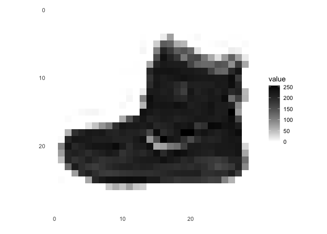
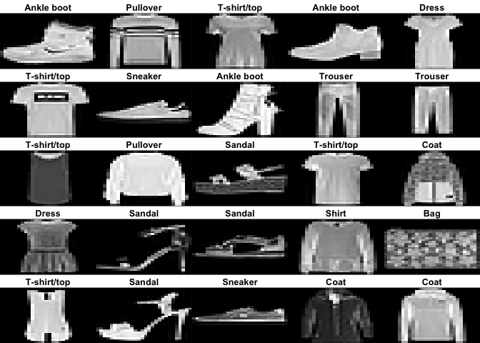
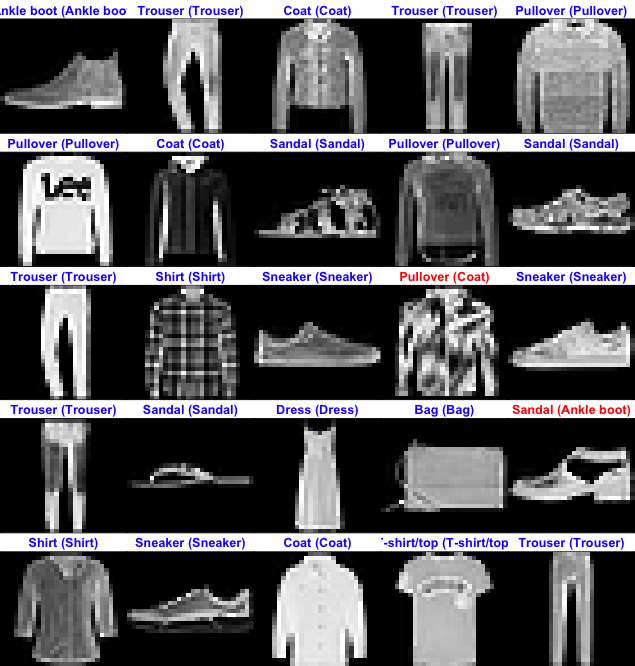

# Fashion MNIST Classification

Neural network classification of the Fashion MNIST database provided by Zalando under MIT Licence. This notebook is written in R and uses the Keras API.

## Data Preparation

The dataset contains 70,000 grayscale images split in 10 categories. The images show individual articles
of clothing at low resolution.

``` r
library(keras)

fashion_mnist <- dataset_fashion_mnist()

c(train_images, train_labels) %<-% fashion_mnist$train
c(test_images, test_labels) %<-% fashion_mnist$test

class_names = c('T-shirt/top',
                'Trouser',
                'Pullover',
                'Dress',
                'Coat', 
                'Sandal',
                'Shirt',
                'Sneaker',
                'Bag',
                'Ankle boot')
```

Each image is 28 x 28 pixels

``` r
library(tidyr)
library(ggplot2)

image_1 <- as.data.frame(train_images[1, , ])
colnames(image_1) <- seq_len(ncol(image_1))
image_1$y <- seq_len(nrow(image_1))
image_1 <- gather(image_1, "x", "value", -y)
image_1$x <- as.integer(image_1$x)

ggplot(image_1, aes(x = x, y = y, fill = value)) +
  geom_tile() +
  scale_fill_gradient(low = "white", high = "black", na.value = NA) +
  scale_y_reverse() +
  theme_minimal() +
  theme(panel.grid = element_blank())   +
  theme(aspect.ratio = 1) +
  xlab("") +
  ylab("")
```

<!-- -->

The images being grayscaled, the pixel values fall in the range of 0 to 255. We scale these values to a range of 0 to 1 before feeding the neural network model. For this, we simply divide by 255

``` r
train_images <- train_images / 255
test_images <- test_images / 255
```

Here’s how our dataset is looking

``` r
par(mfcol=c(5,5))
par(mar=c(0, 0, 1.5, 0), xaxs='i', yaxs='i')
for (i in 1:25) { 
  img <- train_images[i, , ]
  img <- t(apply(img, 2, rev)) 
  image(1:28, 1:28, img, col = gray((0:255)/255), xaxt = 'n', yaxt = 'n',
        main = paste(class_names[train_labels[i] + 1]))
}
```

<!-- -->

## Model Building

We’ll use 3 layers for our neural network:

  - The first layer flatten our images reprsentations (from 2D arrays to
    1D)
  - The second layer can be seen as the “main” layer. It is the one that
    will “learn”. It contains 128 nodes
  - The last layer is a 10-node softmax layer used for predictions output

``` r
model <- keras_model_sequential()
model %>%
  layer_flatten(input_shape = c(28, 28)) %>%
  layer_dense(units = 128, activation = 'relu') %>%
  layer_dense(units = 10, activation = 'softmax')
```

The model is composed of a cross-entropy loss function and the adam optimizer

``` r
model %>% compile(
  optimizer = 'adam', 
  loss = 'sparse_categorical_crossentropy',
  metrics = c('accuracy')
)
```

## Training

``` r
model %>% fit(train_images, train_labels, epochs = 4, verbose = 2)
```

## Analysis

We can now evaluate how the model performs on the test dataset

``` r
score <- model %>% evaluate(test_images, test_labels, verbose = 0)
cat('Test loss:', score['loss'], "\n")
```

    ## Test loss: 0.3810836

``` r
cat('Test accuracy:', score['accuracy'], "\n")
```

    ## Test accuracy: 0.862

Training and test accuracies are close, our model should be fine.

## Predictions

To give us an idea of how our neural network is doing, lets visualize some predictions

``` r
predictions <- model %>% predict(test_images)

for (i in 1:25) { 
  img <- test_images[i, , ]
  img <- t(apply(img, 2, rev)) 
  # subtract 1 as labels go from 0 to 9
  predicted_label <- which.max(predictions[i, ]) - 1
  true_label <- test_labels[i]
  if (predicted_label == true_label) {
    color <- '#2200FF' 
  } else {
    color <- '#FF0000'
  }
  image(1:28, 1:28, img, col = gray((0:255)/255), xaxt = 'n', yaxt = 'n',
        main = paste0(class_names[predicted_label + 1], " (",
                      class_names[true_label + 1], ")"),
        col.main = color)
}
```


